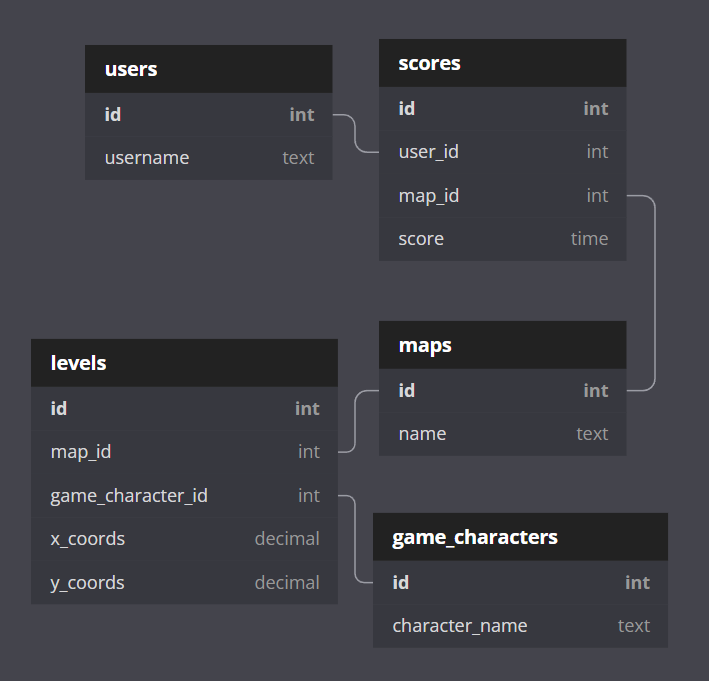

# Where is Waldo
Find Waldo and his friends in the map as fast as you can!

## About this app

This app was created to learn how to use React as front-end with Ruby on Rails as back-end. 

## How the app works

The front and back end are treated as 2 different apps.
The front-end communicates with the back-end using http requests.

The coordinates of the characters into the map are stored inside the database, and when the user opens a level, a fetch request is made to the database to fetch the coordinates of the characters.
If the user's click coordinates cooresponds to the ones fetched from the database (and stored into React state), the character will be selected.

Also the user's click coordinates are converted to different values based on what the current screen resolution is. For example if Waldo is hiding at x_coords: 1641, y_coords: 900 on a 1920x1080 viewport, on a 1280x720 viewport the user should click at x_coords: 1094, y_coords: 506.

## Routes
The Routes are handled by React Router. There are only 2 routes, `/` and `/level`.

The `/level` route was built with the DRY (Don't repeat yourself) concept in mind so it will display all levels (there is not a separate route for each level).
The content in the page will be rendered based on the information stored into React State. When the user clicks a levle inside `/` route, the state is updated and stores the level that the user clicked.

## User handling

When the user first enters the app, he will be asked to insert a username. The username must be between 2 and 10 characters with validations handled at database level and errors displayed. The ID of the user will also be saved to state.

After the username is accepted it will be displayed in the top-right and will also be used to register scores.

## Scores

The score is registered only when the user finds all 4 characters into the map.

# Database Tables

https://dbdiagram.io/

