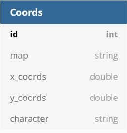

# README

# Where is Waldo

## About this app

This app was created to learn how to use React as front-end on Ruby on Rails. 
Rails is used as back-end and handles API requests from the fron-end.

# Database Table

